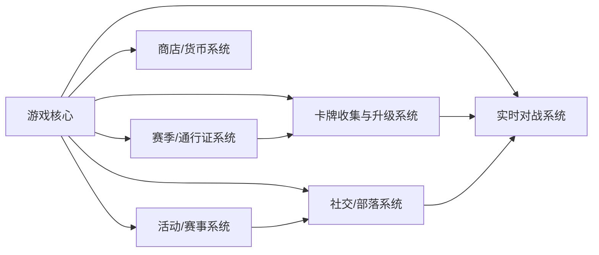
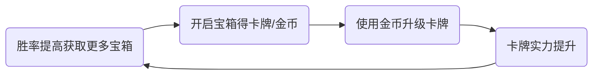
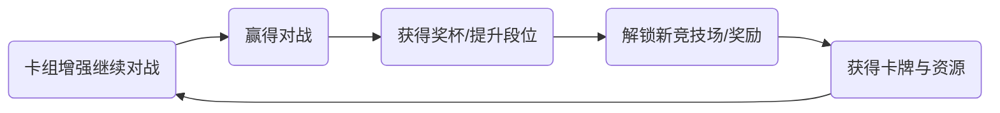
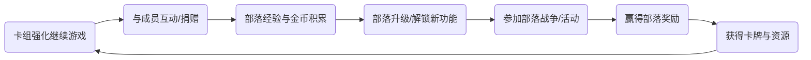

+++
title = "《部落冲突：皇室战争》深度分析报告"
date = 2026-03-11
draft = false
tags = ["游戏分析", "皇室战争"]
categories = ["游戏"]
description = "《部落冲突：皇室战争》游戏深度分析报告，涵盖市场表现、核心玩法系统拆解及改进建议。"
+++

# 《部落冲突：皇室战争》深度分析报告

## 执行摘要

《部落冲突：皇室战争》（Clash Royale）是芬兰厂商Supercell于2016年推出的实时多人卡牌对战手游，采用了《部落冲突》中的角色和卡牌元素。该游戏在全球市场表现优异：截至2020年7月，Sensor Tower统计其累计收入已超过30亿美元，累计下载量约4.69亿次。2025年，《皇室战争》迎来复苏：6个月内月下载量从50万增至300万，月净收入从900万美元飙升至3300万美元（见图1）；全年收入约6.468亿美元，同比大增148.5%。不过，目前收入与下载量已接近峰值，随后的下滑趋势已不可避免。游戏的核心亮点包括快节奏的3分钟对战、多样的卡牌策略、丰富的社交（部落）互动和不断更新的赛季活动。总体来看，《皇室战争》凭借成熟玩法和稳定更新，依然在全球策略手游中占据领先地位。然而，随着游戏进入下一个生命周期阶段，**用户对平衡性和创新性的需求增加**，产品需针对社交、匹配和付费结构进行迭代优化，以保持长期吸引力和盈利能力。

*关键词：Clash Royale；市场表现；核心玩法；闭环分析；策略手游*

## 一、游戏概述

**游戏简介：** 《皇室战争》是一款即时在线卡牌策略手游，由Supercell开发。玩家使用卡牌召唤部队、防御和法术，目标是在对战中摧毁对方的国王塔或公主塔以取得胜利。每场对战限时3分钟（平局后加时），强调快速决策和卡牌配合。2016年3月2日游戏全球首发，随后在多个国家/地区App Store畅销榜和免费榜上名列前茅。2016年3月31日，《皇室战争》Android版本在中国市场正式上线，由昆仑游戏代理登陆360、华为、小米等多家应用商店。

- **题材与美术风格：** 游戏延续《部落冲突》的卡通奇幻风格，角色造型萌趣夸张，场景色彩鲜艳明快，兼具现代和中世纪元素。诸如骑士、野蛮人、飞龙等角色形象生动可爱，易于吸引广泛玩家群体。
- **平台与付费点：** 《皇室战争》覆盖iOS和Android平台（中国版Android由昆仑游戏代理）。采用免费游玩模式，游戏内通过金币、宝石等虚拟货币出售宝箱、卡牌升级和赛季通行证。玩家可以购买宝石加速宝箱开启、购入传说卡牌、购买通行证升级皮肤及道具等。在免费与付费平衡方面，游戏提供每日任务和免费宝箱，但也鼓励购买额外资源加速进度。
- **时长与用户：** 单局对战时长约3分钟，适合碎片时间游玩，目标用户涵盖青少年及成年人，尤其是喜爱策略和收集元素的玩家。游戏通过快速对战和长线培养相结合，吸引了大量《部落冲突》玩家以及卡牌策略游戏爱好者。
- **系统框架：** 游戏核心由卡牌系统、实时对战系统、社交（部落）系统、赛季通行证系统、商店货币系统和活动赛事系统等模块组成。各模块相互配合，构成完整生态体系，如卡牌的收集与升级支撑对战实力，部落社交增强社区黏性，赛季通行证与活动提供持续更新动力。下图为主要系统模块框架示意（节点间为功能流转关系）：

- **特色与核心亮点：**
  - **快节奏对战：** 每场对战限3分钟，战局紧张刺激，玩家随时可参与。对战节奏快，策略空间大，上手简单却难以精通。
  - **卡牌与收集：** 包含100多种可升级卡牌，卡牌分普通、稀有、史诗、传奇四种品质。玩家通过获得宝箱和完成任务来收集卡牌，并用金币或魔法道具进行升级，使卡牌能力提升。收集和升级体系给玩家带来持续培养的成就感。
  - **社交系统：** 玩家可加入或创建部落，与其他成员聊天、捐赠卡牌并参加部落战争。部落提供了社交归属和资源共享机制，增强了游戏的社区氛围。
  - **丰富的赛季内容：** 游戏定期更新赛季主题，推出季票通行证和限时活动，奖励皮肤、表情、魔法物品等，保持游戏新鲜感。季票分免费与付费两档，鼓励玩家完成任务升级获取稀有奖励。
  - **全球化与可拓展性：** 游戏支持多语言，全球运营；在中国等地区通过正版合作渠道上线。Supercell通过不断优化上手体验和适时推出新元素，使得游戏生命周期持续增长。

## 二、游戏市场表现

**总体数据：** 多方数据显示，《皇室战争》长期处于顶尖行列。Sensor Tower报告指出，截至2020年7月，游戏全球累计下载约4.69亿次，累计玩家支出超过30亿美元；平均每下载收入高达约6.40美元。根据行业分析，2025年该游戏迎来复苏：半年内月下载量从50万上涨至300万，月净收入从900万美元上升到3300万美元。 2025年9月单月净收入约7800万美元（约5.55亿人民币），为游戏上线以来的第三高月流水。PocketGamer统计，2025年全年《皇室战争》玩家消费总额约6.468亿美元，同比增长148.5%。上述数据表明，经过多年发展后，《皇室战争》依然保持了强劲的货币化能力。

**下载与收入排行：** 《皇室战争》常年在App Store/Google Play策略类榜单中名列前茅。根据界面新闻报道，该游戏上线初期即跻身多国App Store免费榜和畅销榜前列。现阶段，中国区域Android正版由昆仑游戏代理，可在360、华为、小米、OPPO等主要应用商店下载。在全球收入排行方面，虽然各平台数据不完全公开，2025年1月该游戏仍位居全球移动游戏收入排行榜第26位。具体到其他指标，如Google Trends，虽然缺少精确公开数据，但**玩家搜索热度在2025年中后期明显回升**，与下载和收入走势相吻合。用户口碑方面，《皇室战争》在移动端评价良好：以2026年苹果App Store为例，其评分约为4.6/5（3.7万条评分）。玩家社区普遍赞赏其易学难精的策略性和持续更新，但也对部分版本平衡调整表达了不满情绪。

**市场数据表：** 以下表格总结了关键市场指标（数据时间点如表中所示）：

| 指标                | 数值（时间点）              | 来源                             |
| ------------------- | --------------------------- | -------------------------------- |
| 全球累计下载量      | ≈4.69亿次（截至2020年7月）  | Sensor Tower (2020年7月)         |
| 全球累计收入        | ≈30亿美元（截至2020年7月）  | Sensor Tower (2020年7月)         |
| 2025年累计收入      | ≈6.468亿美元（2025年全年）  | AppMagic/PocketGamer (2026年2月) |
| 2025年9月单月收入   | 7800万美元（≈5.55亿人民币） | 游戏陀螺 (2025年11月)            |
| iOS用户评价         | 4.6/5（37,000+评分）        | 苹果App Store (2026年)           |
| 中国Android上架时间 | 2016年3月31日               | 界面新闻报道 (2016年)            |
| App Store全球排名（发行后） | 免费榜Top1、畅销榜Top5（常年） | 界面新闻报道 |

**用户口碑与趋势：** 综合全球舆论，《皇室战争》玩家对游戏的整体评价积极。其App Store评测常见褒奖策略深度、卡牌多样等，但也有玩家批评部分更新改变了既有游戏平衡。2026年Supercell CEO帕娜宁在年报中也提到社区对某些改动感到“挫败”，正在进行优化。需要注意的是，最新的用户增长与收入数据已显示出顶部效应：据分析，自2025年初持续增长后，到了第九个月玩家量级似乎已经达到峰值。接下来的变化趋势很可能是逐步下滑——但在新的较高基线下维持稳定。

## 三、核心玩法闭环

《皇室战争》的核心体验围绕策略对战和长线成长设计。以下列举三大核心体验闭环，每个闭环配以Mermaid框架图和说明。

### 核心闭环1：卡牌收集与成长闭环

- **系统定位：** 卡牌系统是游戏基础，负责玩家的卡牌收藏与升级。玩家通过对战获得宝箱（A→B），开启宝箱后获得卡牌和金币等资源（B），随后可用金币升级卡牌（B→C），使卡牌在战斗中表现更强（C→D）。
- **设计目的：** 提供长期目标和成长反馈。通过“对战→成长→更强→对战”的循环，让玩家持续投入时间和资源进行卡牌收集，增强粘性和付费动力。
- **用户体验：** 玩家能直观体验到卡牌升级带来的能力增强，收集新卡牌并组建强力卡组的成就感显著。这一闭环给予玩家渐进式成长的动力。
- **优点：** 成长感强，激发收集欲望；游戏更新可添加新卡牌持续吸引玩家；与对战联动紧密，使付费提升感更直观。
- **缺点：** 后期升级成本极高；运气因素大（稀有卡获取概率低）；新玩家在前期可能感到进展缓慢。此外，若缺乏卡牌平衡，新卡可能过于强力或弱势。
- **改进建议：** 增加额外卡牌获取渠道（如活动奖励、保底系统）；优化宝箱和宝石掉落机制，提高玩家获得资源的稳定性；引入卡牌平衡性检测，定期调整过强或过弱的卡牌，以维护游戏公平。

### 核心闭环2：竞技段位提升闭环

- **系统定位：** 竞技场/段位系统。玩家通过参加1v1或2v2匹配对战（E），胜利后赢得奖杯并提升段位或等级（F→G）。随着段位提升，玩家可进入更高等级的竞技场或获得赛季段位奖励（G→H），包括稀有卡牌、金币等（H→I）。这些奖励增强卡组实力（I），使玩家在后续对战中更具优势，继续参与匹配（I→E）。
- **设计目的：** 构建明确的成长阶梯和竞技目标。通过奖杯和段位，激发玩家竞争心理和荣誉感，鼓励不断对战以赢取更高荣誉和奖励。
- **用户体验：** 晋级时获得成就感；解锁新竞技场使玩家体验新图样和卡牌；持续对战带来紧张刺激的竞技体验。良好的胜利反馈机制让玩家乐于挑战更高段位。
- **优点：** 成长路线清晰，激励持续参与；段位系统自动匹配同水平对手，理论上保证了对战公平性；季末段位奖励强化了节奏感。
- **缺点：** 匹配系统仍存在运气和卡牌等级差异问题，低段玩家偶遇高端卡组易挫败；连败可能导致挫折感；部分玩家可能沉迷提升段位而忽视游戏休闲性。
- **改进建议：** 进一步优化匹配算法，缩小胜率极端情况；为连败玩家提供保护机制（例如保级机制）；增加更多非竞赛模式（如好友局、娱乐挑战）以平衡竞技压力；丰富段位奖励类型，使非付费玩家也能获得实用回报。

### 核心闭环3：部落社交与协作闭环

- **系统定位：** 社交/部落系统。玩家加入部落后可与成员聊天、捐赠卡牌（J→K），捐赠获得部落经验和金币（K→L），使部落升级并解锁更多功能（L→M），如部落战模式（M→N）。参与部落战争或其他集体活动后可获得额外奖励（N→O），这些奖励以卡牌、宝箱或资源形式发放（O→I），用于强化卡组，继而投入更多对战（I→J）。
- **设计目的：** 通过社交和团队合作机制提高留存率，增强玩家归属感。部落系统不仅增加了多人生存空间，还让玩家互相扶持，共同追求目标，提高游戏长期黏性。
- **用户体验：** 在部落中，玩家可以获得同伴支持（如卡牌捐赠）、参与大规模部落战争带来的团体荣耀感。社交互动让游戏不再孤独，提高娱乐性。
- **优点：** 强化了社区感，促进玩家间的长期交流；部落战争等集体活动提供了额外挑战和奖励；互助体系使得新手也能获得资源和指导。
- **缺点：** 部落活跃度不均衡：活跃玩家承担更多捐赠压力；实力不足者在部落战中贡献有限；部落交流工具较为简单，缺少丰富的社交玩法；“捐赠获回报”可能导致高端玩家过快提升，中低端难跟上。
- **改进建议：** 提供智能推荐功能，将新手玩家分配到合适活跃的部落；丰富部落互动内容，如部落任务、公告板、部落聊天表情等；调整捐赠机制，让各等级玩家均有动力贡献；引入多样化部落活动（如部落竞赛、联合任务），提高整体参与度。

------

## 四、主要玩法系统拆解

### 4.1 卡牌收集与升级系统

**功能说明：** 玩家通过对战胜利或完成任务获取宝箱，开启后可获得卡牌及金币等资源；使用金币和“宝石牌”升级卡牌，提升其属性和实力。游戏内卡牌分普通、稀有、史诗、传奇四种品质，级别越高升级所需资源越多。该系统是玩家成长和付费的重要纽带。

**关键数据指标：** 总卡牌数量；各级卡牌比例；玩家平均升级次数；卡牌消耗金币总量；新卡获得概率等。

**用户路径：** 玩家对战赢得宝箱→点击打开宝箱获得卡牌/金币→在卡牌界面使用资源升级卡牌→回到对战使用升级后更强的卡组→循环往复。

**痛点分析：**

- **获卡难度高：** 稀有和传奇卡掉率极低，普通玩家难以快速收集；
- **升级成本大：** 升级高品质卡牌需要大量金币，游戏金币常处于紧缺状态；
- **付费差距：** 付费玩家通过氪金可加速获取卡牌和资源，导致免费玩家成长速度与付费玩家拉大；
- **重复体验：** 宝箱开启和卡牌升级的行为较单一，容易使玩家产生疲劳感。

**改进建议：**

- 增加额外获取途径，如完成指定任务给予特定卡牌奖励；
- 设置保底机制或累计保证出传奇卡，以缓解玩家焦虑；
- 优化金币经济平衡，例如提高免费金币收益或降低升级成本；
- 引入新玩法（如卡牌融合、借用卡组等）增加卡牌系统趣味性。

### 4.2 实时对战与匹配系统

**功能说明：** 该系统负责玩家间的实时对战体验。玩家通过网络匹配进入1v1或2v2对战，对局结束后根据结果给予胜负判定、奖杯变动和战斗宝箱奖励。

**关键数据指标：** 每日总对战场次；平均匹配等待时长；胜率分布；高段位/低段位玩家比例；连胜/连败曲线。

**用户路径：** 玩家点击“对战”→系统匹配玩家→实时对战（3分钟）→结算胜负，胜者获得宝箱并增加奖杯，失败者损失奖杯；玩家可选继续匹配或退回大厅。

**痛点分析：**

- **匹配平衡难题：** 卡牌升级差异和临场运气可能导致匹配不均，有时会出现悬殊对局，给弱势玩家带来挫败；
- **匹配效率：** 高段位匹配等待时间可能较长；对于新手玩家，有时难以快速找到合适对手；
- **游戏平衡：** 部分卡牌和英雄可能在当前版本过强或过弱，影响对战公平性；
- **单一模式：** 长时间只有常规匹配，可能使部分玩家感到乏味。

**改进建议：**

- 优化匹配算法，引入更细致的段位分组和临时平衡机制；
- 设置“匹配保护”（如连败免降机制、保级赛等），降低玩家挫败感；
- 定期对卡牌平衡进行调整（Buff/Debuff），保持对战多样性；
- 增加匹配模式，如好友对战、锦标赛模式、快车赛（限定卡组）等，丰富玩家选择。

### 4.3 社交/部落系统

**功能说明：** 该系统提供玩家社交和团队协作功能。玩家可以创建或加入部落，与其他成员聊天交流；可通过部落互赠卡牌（捐卡）获得奖励；定期举行部落战争和部落冲突挑战赛，奖励部落成员资源。

**关键数据指标：** 部落平均人数与活跃度；每日捐赠次数；部落战参与率；部落等级分布；部落升级进度。

**用户路径：** 玩家创建/加入部落→在部落聊天频道与成员互动→向他人捐赠所需卡牌（或请求所需卡牌）→参与部落战或部落活动→完成后领取部落奖励→重复循环。

**痛点分析：**

- **活跃度不均：** 部落中通常少部分活跃玩家承担主要捐赠和战斗任务，大部分普通玩家贡献较少；
- **社交功能简陋：** 目前聊天和社交功能较基础，缺乏丰富的互动玩法，如公会任务、积分排行等；
- **新手融入难：** 对于刚加入部落的新手，可能因为卡牌捐赠能力有限而难以获得高回报或被归为“寄生党”；
- **部落战门槛：** 部落战要求高等级卡组和战术配合，实力不足的部落难以竞争，导致部分玩家缺乏参与动力。

**改进建议：**

- 增设部落挑战和日常任务，鼓励所有成员参与并获得回报；
- 丰富部落社交功能，如部落内排行榜、荣誉勋章、定制聊天表情等；
- 调整捐赠与奖励机制，让不同活跃度玩家都能获得合理回报；
- 设计更多面向不同水平的部落活动，如新手部落战、小规模内战等，以提升整体参与度。

### 4.4 赛季与通行证系统

**功能说明：** 定期更新赛季主题，玩家通过完成赛季任务获得积分提升赛季等级。通行证分为免费和付费两个版本，随着等级升级可领取奖励（皮肤、表情、宝箱等奖励）。赛季结束后根据最终段位发放额外奖励，并重置赛季进度。

**关键数据指标：** 通行证付费率；任务完成率；赛季等级分布；赛季收入贡献占比。

**用户路径：** 新赛季开始，玩家领取每日/每周任务→完成任务积累积分→升级赛季通行证等级→领取对应奖励；若购买付费通行证，可解锁更多奖励；赛季末根据段位获额外奖励后，赛季重置，开启新周期。

**痛点分析：**

- **任务单一：** 赛季任务往往重复度高，主要集中于常规对战或社交互动，缺乏新颖性；
- **奖励差距：** 免费通行证奖励丰富度远逊于付费通行证，低付费意愿玩家获取的进度道具有限；
- **投入/产出：** 部分玩家反映付费通行证性价比不高，需要投入较长时间才能获取价值；
- **赛季热度：** 长时间连续赛季可能导致玩家疲劳，尤其是在赛季模式单一时。

**改进建议：**

- 设计更多样化的赛季任务（如特殊对战模式挑战、部落任务等），提高玩法趣味；
- 提高免费通行证奖励的吸引力（例如提供更多金币、卡牌奖励），缓解用户焦虑；
- 在赛季中途推出限时小活动或加速器礼包，增加玩家参与热情；
- 优化赛季付费结构，推出更灵活的付费层级或滚动通行证，以满足不同玩家需求。

### 4.5 商店与货币系统

**功能说明：** 商店系统提供游戏内主要货币（金币、宝石、奖券等）的获取与支出渠道。玩家可使用金币升级卡牌，用宝石购买宝箱、加速宝箱开启或购买皮肤、季票等。商店定期上架卡牌包、道具礼包、节日主题皮肤等。

**关键数据指标：** 各种货币的获取与消耗总量；各类礼包/宝箱的销售额；内购转化率；日活付费率；免费与付费玩家比重。

**用户路径：** 对战和活动获取金币/宝石→在商店界面查看商品（宝箱、卡牌、皮肤）→使用货币购买想要的商品或加速道具→获取相应资源或皮肤→重复购买循环。

**痛点分析：**

- **资源平衡：** 免费获得的金币/宝石远不能满足升级需求，玩家常需付费或花费大量时间攒取；
- **价格设定：** 高品质宝箱和皮肤价格昂贵，可能导致部分玩家付费意愿下降；
- **付费与公平：** 大额消费玩家可迅速获得大量资源，产生与普通玩家的差距；
- **缺乏新意：** 商店更新周期长时，商品单调缺乏新颖主题，用户吸引力不足。

**改进建议：**

- 增加免费货币获取途径，如每日签到、观看广告等；
- 推出多样化限时折扣和组合包，激励购买；
- 优化定价策略，合理调整稀有商品价格；
- 增加可选性付费项目（如皮肤、装扮、音效包等外观类物品），使不同玩家都能找到合适的付费点。

### 4.6 活动与赛事系统

**功能说明：** 此系统包括限时活动模式、锦标赛、社交竞技（如好友赛、全服大奖赛）等。活动通常设定特殊规则（限卡牌池、特殊地图等），参与可获取活动专属奖励。官方不定期举办全球赛、线上锦标赛和社区挑战赛，提供高额奖励并提升玩家黏性。

**关键数据指标：** 活动参与度；活动奖励完成率；玩家活跃度/留存变化；赛事观看数/报名数。

**用户路径：** 活动开启时收到通知→进入特殊活动模式对战→获得活动积分或奖章→用积分兑换奖励；参与锦标赛需要一定门票，成功晋级可赢得宝箱和独家称号。

**痛点分析：**

- **活动重复性：** 部分活动模式与玩法较单一，玩家可能感到形式雷同；
- **奖励吸引力：** 活动奖励往往集中在少量稀有道具，普通奖励吸引力有限；
- **参与门槛：** 锦标赛等高阶活动要求门票和战斗力，限制了广泛参与。
- **时间消耗：** 高强度活动需要大量时间投入，可能导致部分玩家疲劳。

**改进建议：**

- 创新活动内容，如全新游戏机制或剧情模式；
- 增加活动奖励层级，提高全员参与感（例如增加常规奖励档）；
- 降低竞技赛事门槛（如免费领取一定数量门票）；
- 引入玩家创意活动（地图编辑赛、社区设计大赛等）增强互动性。

------

## 五、整体评价与建议

**优势：** 《皇室战争》凭借成熟的设计和强大的品牌效应展现出多方面优势。其**易学难精**的游戏机制使新手容易上手，而卡牌策略和技能配合又保证高端玩家的深度体验；游戏持续不断的版本更新和活动保持了玩家的新鲜感；全球化运作和官方电竞赛事提高了游戏的影响力和玩家活跃度；多样化的付费项目和完善的经济系统使得游戏具有高变现能力。

**劣势：** 随着上线多年，游戏也面临挑战。一方面，核心玩法创新不足，游戏体验逐渐稳定甚至有审美疲劳的风险；另一方面，玩家社区对“平衡性”问题十分敏感，某些付费内容（例如卡牌进化、英雄卡）引发了讨论。来自市场分析的视角也指出，目前游戏正处于“见顶”阶段，将不可避免进入逐步下滑期。此外，竞争对手和市场环境不断变化，例如其他厂商通过激进推广在类似品类（如4X策略）取得突破，这对Supercell的传统模式提出了新要求。

**改进建议（优先级）：**

1. **短期（1年内）：** 立即优化平衡性和玩家体验。如对社区反馈的强势卡牌及时调整，修复匹配系统问题，优化新手引导和奖励，让新玩家融入更快；对核心玩法做细节改进（例如增加更多可选卡组或地形变化）提升娱乐性。
2. **中期（1-3年）：** 扩展社交和玩法深度。推出新的对战模式（如实时3v3、角色扮演活动模式），增强社交互动（部落活动、好友联盟等）；丰富内容生态，比如更多跨界联动皮肤或内容合作，维持玩家兴趣。对赛季系统和活动体系做创新，提高长线留存。
3. **长期（3年以上）：** 战略层面考虑多元化和新项目。可能需要在继承《皇室战争》成功经验的同时，开发新游戏（例如Supercell已着手测试的多款新作），避免过度依赖单一IP。技术层面可引入更先进的用户获取策略或AI辅助匹配；紧跟移动游戏趋势，如适配VR/AR体验等创新模式，以确保长期市场竞争力。

## 参考来源

本报告数据来源和引用包括：Supercell官方网站和公告、Sensor Tower与AppMagic等第三方统计、以及中国权威游戏媒体（如界面新闻、游戏陀螺）、苹果App Store等。文中提及的市场数据均注明了来源和时间，确保可追溯性。