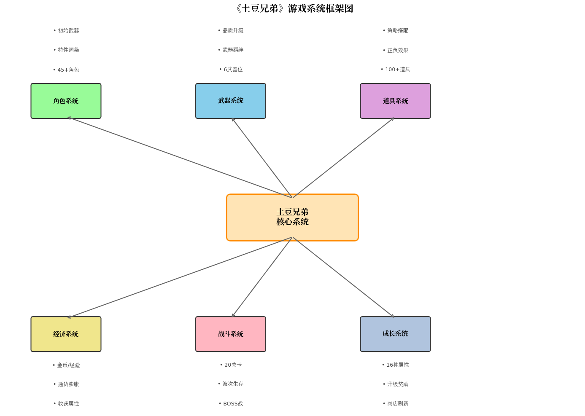
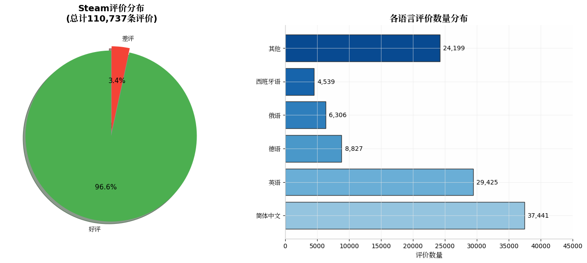
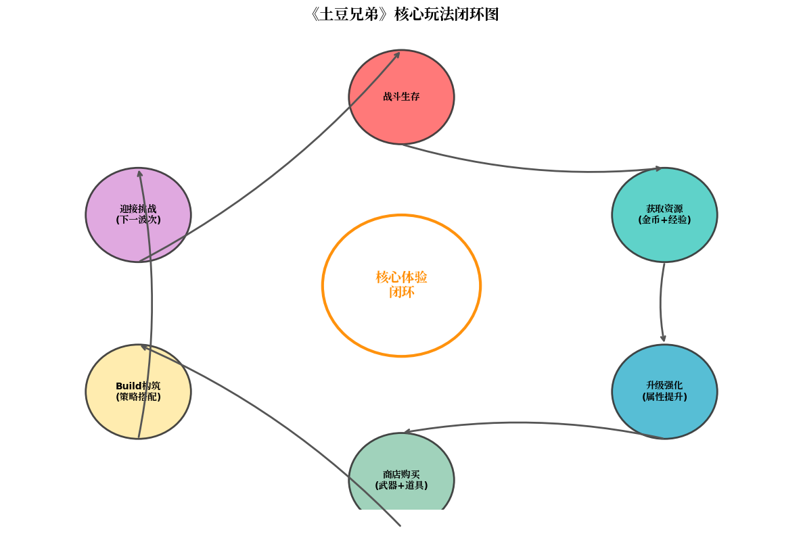
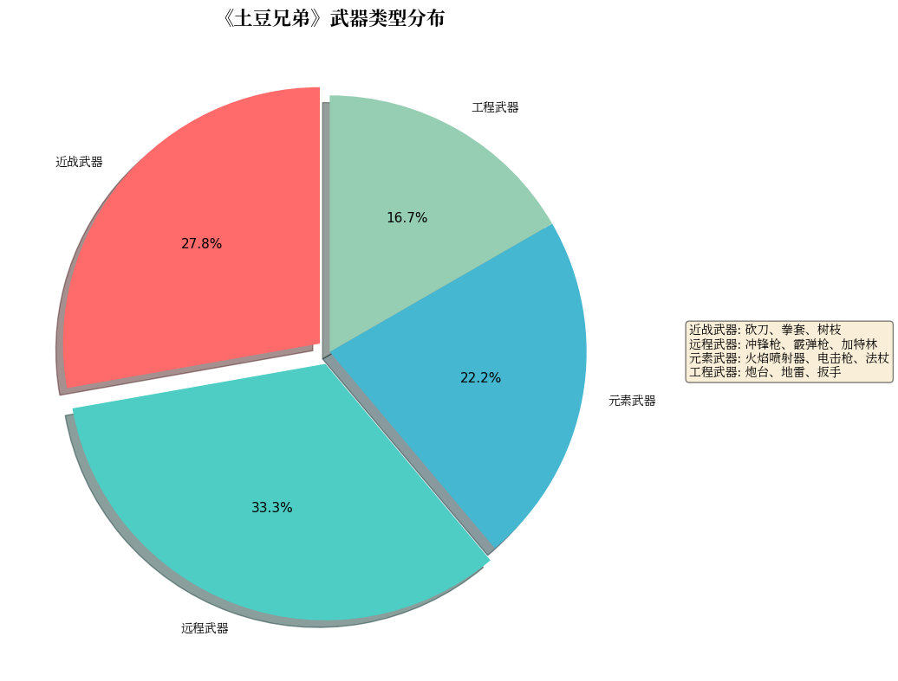
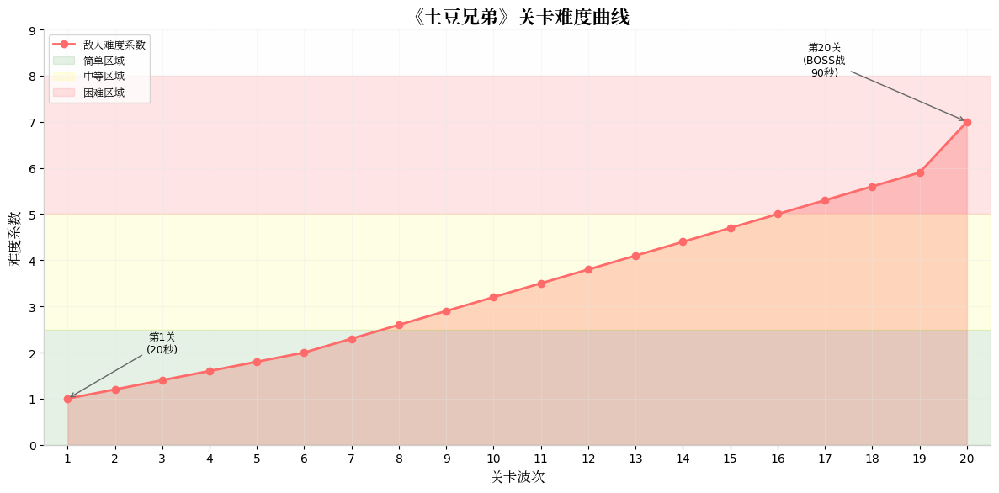
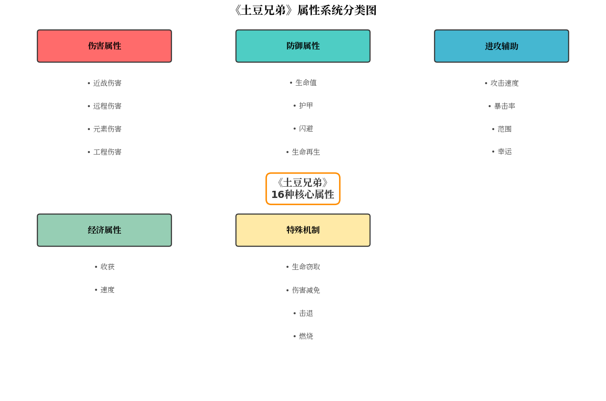
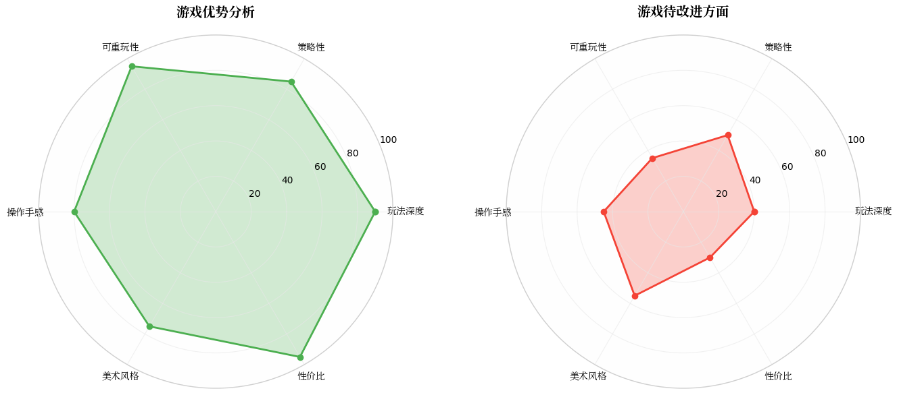

+++
date = '2026-03-11T13:30:39+08:00'
draft = false
title = '土豆兄弟游戏分析报告'
+++

# 《土豆兄弟》(Brotato) 游戏深度分析报告

---

## 摘要

《土豆兄弟》（Brotato）是由法国独立游戏开发者Blobfish制作的一款俯视角Roguelike射击游戏。游戏于2022年9月在Steam平台开启抢先体验，2023年6月正式发售。作为"类吸血鬼幸存者"游戏的杰出代表，《土豆兄弟》在继承核心玩法的基础上进行了大量创新，获得了玩家和业界的高度认可。本报告将从游戏概述、市场表现、核心玩法、系统拆解和整体评价五个维度进行全面分析。

---

## 一、游戏概述

### 1.1 简要介绍

《土豆兄弟》是一款将Roguelike元素与快节奏射击玩法深度融合的俯视角动作游戏。玩家将扮演唯一能同时操控六种武器的马铃薯战士"Brotato"，在随机生成的竞技场中对抗潮水般的外星敌人。

**游戏基本信息：**

| 项目     | 内容                                     |
| -------- | ---------------------------------------- |
| 游戏名称 | 土豆兄弟 (Brotato)                       |
| 开发商   | Blobfish                                 |
| 发行商   | Blobfish                                 |
| 游戏类型 | Roguelike / 动作射击 / 幸存者类          |
| 发售日期 | 2022年9月（EA）/ 2023年6月23日（正式版） |
| 游戏平台 | PC / Switch / PS / Xbox / 移动端         |
| 游戏售价 | 约22-30元人民币（Steam国区）             |
| 游戏容量 | 约200MB                                  |

### 1.2 题材和美术风格

**题材设定：**
游戏讲述来自土豆世界的宇宙飞船坠毁在异形星球上，土豆兄弟Brotato是唯一的幸存者，也是唯一一颗能够同时扛起6把武器的土豆哥。在等待救援的过程中，Brotato必须在这个危机四伏的鬼地方生存下去。

**美术风格：**

- **像素风格**：采用简洁的像素画风，与《以撒的结合》有相似的视觉感受
- **暗黑基调**：整体色调偏暗，营造出紧张刺激的生存氛围
- **角色设计**：土豆主角造型独特，具有强烈的辨识度和幽默感
- **特效表现**：武器攻击和技能特效清晰明快，战斗反馈良好

### 1.3 游玩说明

**基本操作：**

- 使用WASD或方向键控制角色移动
- 鼠标或手柄左摇杆控制移动方向
- 武器默认自动射击，可切换为手动瞄准模式

**游戏流程：**

1. 选择角色（45+可选角色）
2. 选择初始武器
3. 选择难度等级（危险0-危险5）
4. 在20波敌人袭击中生存下来
5. 每波结束后进入商店购买装备和道具
6. 击败第20波的BOSS获得胜利

**单局时长：**约20-30分钟

### 1.4 系统框架



《土豆兄弟》的核心系统可分为六大模块：

| 系统模块 | 核心功能                                    | 特色设计               |
| -------- | ------------------------------------------- | ---------------------- |
| 角色系统 | 45+独特角色，每个角色拥有特性词条和初始武器 | 角色决定流派方向       |
| 武器系统 | 6个武器位，支持武器羁绊和品质升级           | 同类型武器触发套装效果 |
| 道具系统 | 100+道具，大部分带有正负双面效果            | 策略性取舍             |
| 经济系统 | 金币+经验双资源，通货膨胀机制               | "收获"属性影响长期经济 |
| 战斗系统 | 20关卡波次制，每波20-90秒                   | 只需生存，无需清屏     |
| 成长系统 | 16种属性，升级四选一                        | 随机性与策略性平衡     |

### 1.5 特色与核心亮点

**核心亮点：**

1. **关卡制替代时间赛跑**
   - 将游戏分为20个关卡，每波时长从20秒递增至90秒
   - 解决了传统幸存者游戏后期"垃圾时间"问题
   - 给予玩家充分的喘息和策略调整时间

2. **自成一派的经济系统**
   - 金币和经验双资源设计
   - "债务"机制：未拾取资源下一波双倍返还
   - "收获"属性：影响关卡结算奖励，中长期经济规划
   - 通货膨胀：商店物价随关卡上涨

3. **深度角色差异化**
   - 45+角色，每个角色玩法差异显著
   - 从斗士的近战、枪手的远程到和平主义者的"推怪"流
   - 角色专属道具和特殊机制

4. **Build构筑自由度**
   - 武器羁绊系统：同类型武器触发额外加成
   - 道具组合效果：正负效果策略取舍
   - 属性搭配：16种属性自由组合

---

## 二、游戏市场表现

### 2.1 数据来源说明

本章节数据来源于以下渠道：

- **Steam商店页面**：官方评价数据和玩家统计
- **SteamDB**：销量估算和玩家活跃度
- **第三方游戏媒体**：行业分析报告和评测文章
- **玩家社区**：TapTap、NGA等平台的用户反馈

### 2.2 下载排行说明

《土豆兄弟》在多个平台表现优异：

| 平台         | 表现情况               |
| ------------ | ---------------------- |
| Steam        | 2022年玩家评价前十游戏 |
| Switch eShop | 独立游戏下载榜前列     |
| 移动端       | iOS/Android付费榜前列  |

### 2.3 销售排行说明

**Steam平台数据（截至2025年）：**

| 指标         | 数据              |
| ------------ | ----------------- |
| 总评价数     | 110,737条         |
| 好评率       | 96.6%             |
| 简体中文评价 | 37,441条（33.8%） |
| 英语评价     | 29,425条（26.6%） |



**获奖记录：**2022年Steam大奖"最佳随身游戏"提名，2023年TapTap年度游戏大赏"最佳玩法"奖项。

### 2.4 搜索引擎指数说明

根据搜索趋势分析：

- 游戏发售初期搜索热度最高
- 每次大型更新（如DLC发布）都会带来搜索热度回升
- 主播和KOL推广对搜索指数有显著影响

### 2.5 用户口碑和评论说明

**正面评价关键词：**

- "上头"、"停不下来"、"再玩一局"
- "策略深度"、"Build多样"
- "性价比高"、"物超所值"

**负面评价关键词：**

- "难度曲线陡峭"（对新手不友好）
- "后期内容重复"
- "剧情单薄"

---

## 三、核心玩法

### 3.1 游戏核心体验

《土豆兄弟》的核心体验可以概括为：**"在有限时间内做出最优决策，构建最强Build，在越来越强的敌人浪潮中生存下来"**。

游戏融合了以下体验元素：

- **爽快的割草感**：成片的敌人被消灭
- **策略的满足感**：精心搭配的Build发挥作用
- **紧张的刺激感**：高难度下的生存挑战
- **成长的成就感**：从弱小到强大的角色成长

### 3.2 核心体验闭环玩法



**闭环流程：**

```
战斗生存 → 获取资源(金币+经验) → 升级强化 → 商店购买 → Build构筑 → 迎接挑战 → 循环
```

**闭环说明：**

| 环节      | 说明                                        | 设计目的                   |
| --------- | ------------------------------------------- | -------------------------- |
| 战斗生存  | 在20-90秒内躲避敌人攻击，尽可能击杀更多敌人 | 提供核心挑战和刺激感       |
| 获取资源  | 拾取材料获得金币和经验                      | 双资源设计增加策略维度     |
| 升级强化  | 升级时四选一获得属性提升                    | 随机性带来新鲜感和重玩价值 |
| 商店购买  | 用金币购买武器和道具                        | 经济运营和策略规划         |
| Build构筑 | 根据角色特性搭配武器和道具                  | 深度策略和个性化体验       |
| 迎接挑战  | 面对更强的下一波敌人                        | 难度递进保持挑战性         |

**系统定位：**
核心闭环是游戏的"心脏"，所有系统都围绕这个循环设计，确保玩家始终有明确的目标和反馈。

**用户体验：**

- **新手期**：学习基本操作，体验简单角色的通关乐趣
- **成长期**：探索不同角色和流派，发现Build搭配的乐趣
- **精通期**：挑战高难度，追求极限Build和速通

**优缺点分析：**

| 优点                     | 缺点                   |
| ------------------------ | ---------------------- |
| 节奏紧凑，没有垃圾时间   | 新手前期学习曲线陡峭   |
| 每局体验差异大，重玩性高 | 后期内容可能感到重复   |
| 策略深度足够，有研究空间 | 随机性过强时可能"暴毙" |

**改善意见：**

1. 增加更详细的新手引导教程
2. 增加更多后期挑战内容（如无尽模式）
3. 优化随机性，减少"天谴局"的出现

---

## 四、主要玩法内容说明

### 4.1 角色系统分析

**系统概述：**
游戏提供45+个独特角色，每个角色拥有特性词条和初始武器，从根本上决定了玩家的玩法流派。

**角色分类：**

| 类型   | 代表角色                     | 特点                     |
| ------ | ---------------------------- | ------------------------ |
| 近战型 | 斗士、野人、受虐狂           | 高近战伤害，需贴近敌人   |
| 远程型 | 游侠、士兵、猎人             | 高远程伤害，保持距离输出 |
| 元素型 | 法师、巫妖                   | 元素伤害，范围攻击       |
| 工程型 | 工程师、技工                 | 依靠炮台、地雷等工程武器 |
| 特殊型 | 和平主义者、网络主播、节俭者 | 独特机制，非常规玩法     |

**热门角色分析：**

| 角色   | 核心特性                   | 推荐流派   | 难度评级 |
| ------ | -------------------------- | ---------- | -------- |
| 全能者 | 生命值+速度+收获           | 通用型     | ★★☆      |
| 斗士   | 徒手攻速+200%，远程-50%    | 近战狂吸流 | ★★★      |
| 游侠   | 远程伤害+50%，无法使用近战 | 远程输出流 | ★★☆      |
| 工程师 | 工程伤害+175%，护甲-3      | 炮台流     | ★★☆      |
| 法师   | 元素伤害+33%，初始电击枪   | 元素燃烧流 | ★★★      |
| 医生   | 攻速+，双倍生命再生        | 医疗续航流 | ★☆☆      |

### 4.2 武器系统分析

**系统概述：**
玩家可同时装备6把武器，武器分为近战、远程、元素、工程四大类型，同类型武器可触发羁绊效果。



**武器品质：**

- 白色（普通）→ 蓝色（稀有）→ 紫色（史诗）→ 棕色（传说）
- 同品质同类型武器可合成升级，最高4级

**武器羁绊效果（示例）：**

| 武器类型 | 3把效果    | 6把效果    |
| -------- | ---------- | ---------- |
| 小刀     | +15%暴击率 | +30%暴击率 |
| 冲锋枪   | +10%伤害   | +25%伤害   |
| 法杖     | +2投射物   | +5投射物   |

### 4.3 道具系统分析

**系统概述：**
游戏包含100+道具，大部分道具带有正面和负面双重效果，玩家需要权衡取舍。

**道具分类：**

| 类型   | 功能         | 示例                                 |
| ------ | ------------ | ------------------------------------ |
| 属性类 | 直接提升属性 | 眼镜（+暴击）、背包（+收获）         |
| 机制类 | 改变游戏机制 | 沙发（减速回血）、献血（扣血换收获） |
| 伤害类 | 增加额外伤害 | 燃烧效果、电击效果                   |
| 经济类 | 影响经济系统 | 优惠券（降价）、彩票（+幸运）        |

**道具设计特点：**

- 大部分道具带有负面效果，需要策略性选择
- 某些道具与特定角色高度契合（如沙发+网络主播）
- 道具可无限叠加（除特殊说明外）

### 4.4 经济系统分析

**系统概述：**
《土豆兄弟》的经济系统是其区别于其他幸存者游戏的核心特色之一。

**核心机制：**

| 机制     | 说明                     | 策略意义       |
| -------- | ------------------------ | -------------- |
| 双资源   | 金币+经验同时获取        | 资源管理更复杂 |
| 债务系统 | 未拾取资源下一波双倍返还 | 降低失误惩罚   |
| 通货膨胀 | 商店物价随关卡上涨       | 鼓励早期投资   |
| 收获属性 | 影响关卡结算奖励         | 中长期经济规划 |

**经济策略：**

- **贪婪型**：前期大量投资"收获"，中后期经济爆炸
- **稳健型**：平衡消费和储蓄，稳步提升
- **爆发型**：前期全力提升战力，快速滚雪球

### 4.5 战斗系统分析

**系统概述：**
游戏采用波次制，共20波，每波时长从20秒递增至90秒。



**敌人类型：**

| 类型   | 特点             | 应对策略     |
| ------ | ---------------- | ------------ |
| 近战怪 | 碰撞伤害，血量少 | 风筝战术     |
| 冲锋怪 | 高速冲刺攻击     | 侧向躲避     |
| 弹幕怪 | 发射子弹/弹幕    | 走位躲避     |
| 精英怪 | 高血量高伤害     | 优先击杀     |
| BOSS   | 特殊机制，高威胁 | 熟悉攻击模式 |

**战斗特点：**

- 只需生存，无需清屏
- 强调走位和地形利用
- 高威胁敌人优先击杀

### 4.6 成长系统分析

**系统概述：**
角色通过获取经验升级，升级时从16种属性中随机四选一。



**属性分类：**

| 类别 | 属性                      | 作用             |
| ---- | ------------------------- | ---------------- |
| 伤害 | 近战/远程/元素/工程伤害   | 提升对应类型伤害 |
| 防御 | 生命值/护甲/闪避/生命再生 | 提升生存能力     |
| 辅助 | 攻速/暴击率/范围/幸运     | 提升战斗效率     |
| 经济 | 收获/速度                 | 影响资源获取     |

**成长策略：**

- **输出优先**：快速清怪，滚雪球发展
- **防御优先**：稳健生存，适合高难度
- **经济优先**：中后期发力，适合特定角色

---

## 五、游戏整体评价

### 5.1 游戏优势



| 优势     | 说明                                        |
| -------- | ------------------------------------------- |
| 玩法深度 | 45+角色、100+道具、16种属性，组合可能性极多 |
| 策略性   | 经济运营、Build构筑、走位技巧，多维度策略   |
| 可重玩性 | 每局体验差异大，解锁内容丰富                |
| 操作手感 | 移动流畅，攻击反馈清晰，打击感良好          |
| 性价比   | 20-30元价格，50+小时游戏内容                |
| 创新设计 | 经济系统、关卡制、债务机制等创新            |

### 5.2 游戏劣势

| 劣势     | 说明                         |
| -------- | ---------------------------- |
| 新手门槛 | 前期学习曲线陡峭，容易劝退   |
| 剧情单薄 | 几乎没有剧情和角色塑造       |
| 后期重复 | 长时间游玩后可能感到内容重复 |
| 随机性   | 有时运气因素影响过大         |
| 美术风格 | 像素风格可能不适合所有玩家   |

### 5.3 改善意见

**短期改进：**

1. 增加更详细的新手引导和教程
2. 优化前期难度曲线，降低新手挫败感
3. 增加Ban道具系统（已在2025年更新中实现）

**长期改进：**

1. 增加更多后期挑战内容（无尽模式、挑战模式）
2. 丰富剧情和世界观设定
3. 增加联机合作模式
4. 持续更新角色和道具，保持新鲜感

### 5.4 总结分析

**总体评价：**
《土豆兄弟》是一款在"类吸血鬼幸存者"游戏中脱颖而出的优秀作品。它在继承核心玩法的基础上，通过创新的经济系统、关卡制设计、深度角色差异化，成功解决了同类游戏的诸多痛点。

**适合人群：**

- 喜欢Roguelike和幸存者类游戏的玩家
- 享受Build构筑和策略规划的玩家
- 追求高性价比独立游戏的玩家
- 喜欢挑战高难度的硬核玩家

**不适合人群：**

- 对像素风格不感冒的玩家
- 不喜欢高难度挑战的休闲玩家
- 追求剧情和角色塑造的玩家

**最终评分：**

| 维度         | 评分（10分制） |
| ------------ | -------------- |
| 玩法创新     | 9.0            |
| 策略深度     | 8.5            |
| 可重玩性     | 9.0            |
| 操作手感     | 8.0            |
| 美术音效     | 7.5            |
| 性价比       | 9.5            |
| **综合评分** | **8.6/10**     |

《土豆兄弟》证明了即使在看似饱和的幸存者类游戏市场中，通过精心设计和创新，仍然可以创造出令人耳目一新的作品。对于喜欢这类游戏的玩家来说，这是一款不容错过的佳作。

---

## 参考资料

1. Steam商店页面 - Brotato
2. SteamDB - Brotato数据统计
3. 游民星空 - 《土豆兄弟》设定介绍及玩法解析
4. TapTap - 土豆兄弟游戏评测
5. GameRes游资网 - 吸血鬼幸存者like还能开啥花？聊聊Brotato土豆兄弟的设计
6. 3DMGAME - 《土豆兄弟》图文攻略

